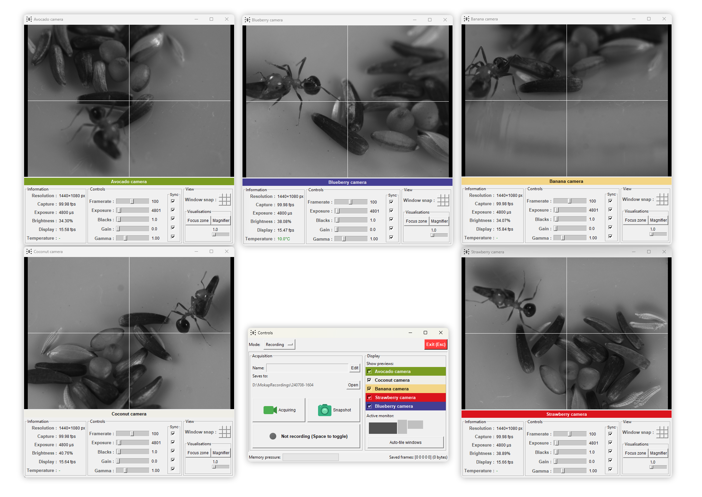
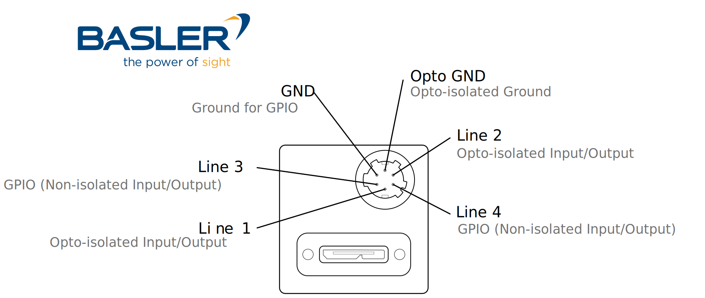
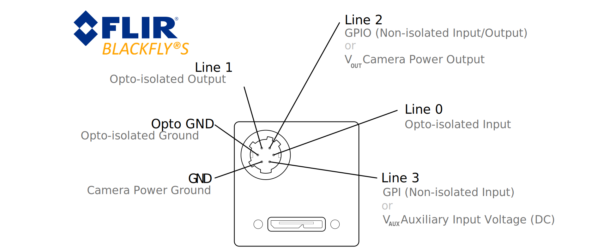

<!-- Improved compatibility of back to top link: See: https://github.com/othneildrew/Best-README-Template/pull/73 -->
<a id="readme-top"></a>

<!-- PROJECT LOGO -->
<br />
<div align="center">
  <a href="https://github.com/github_username/repo_name">
    
  </a>

<h3 align="center">Mokap</h3>

  <p>
    An easy to use but powerful multi-camera acquisition software
    <br />
    <br />
  </p>
</div>


<!-- TABLE OF CONTENTS -->
<details>
  <summary>Table of Contents</summary>
  <ol>
    <li>
      <a href="#about-the-project">About The Project</a>
    </li>
    <li>
      <a href="#getting-started">Getting Started</a>
      <ul>
        <li><a href="#prerequisites">Prerequisites</a></li>
        <li><a href="#installation">Installation</a></li>
      </ul>
    </li>
    <li><a href="#usage">Usage</a></li>
    <li><a href="#troubleshooting">Troubleshooting</a></li>
    <li><a href="#roadmap">Roadmap</a></li>
    <li><a href="#license">License</a></li>
    <li><a href="#contact">Contact</a></li>
  </ol>
</details>


<!-- ABOUT THE PROJECT -->
## About The Project


Mokap is an easy to use multi-camera acquisition software developed for animal behaviour recording using hardware-triggered (synchronised) machine vision cameras.

### Features
* Cross platform (Linux, Windows, macOS)
* Supports Basler and FLIR cameras (they can be used at the same time, yes 🙂)
* Supports hardware-synchronisation of cameras (using a Raspberry Pi, an Aduino, a USB-to-TTL adapter, or one of your cameras itself)
* Many encoding options (with or without GPU acceleration)
* Live multi-camera calibration and pose estimation
* Supports classic USB (and internal) Webcams, but their features are limited (no hardware sync, etc.)
* Generate printable calibration boards in 1 click

<p>(<a href="#readme-top">back to top</a>)</p>


<!-- GETTING STARTED -->
## Getting Started

This is an example of how you may give instructions on setting up your project locally.
To get a local copy up and running follow these simple example steps.

### Prerequisites

#### ffmpeg (optional)
If you wish to use straight-to-video encoding, you will need [ffmpeg](https://www.ffmpeg.org/download.html) installed on your machine.

* Linux (most Debian-based distros):
   ```sh
   sudo apt install ffmpeg
   ```
* Windows:
   ```sh
   winget install --id Gyan.FFmpeg
   ```
* macOS:
   ```sh
   brew install ffmpeg
   ```
If you do not want to use ffmpeg, you can still use Mokap in image mode (videos will be written as individual frames), but be aware that this is much slower.

#### uv:

We recommend using uv to manage Python environments and install Mokap easily.
* If you don't have uv installed, see [here](https://github.com/astral-sh/uv).

### Installation

#### Basler Pylon SDK

* Download the installer package for your system: https://www2.baslerweb.com/en/downloads/software-downloads/

###### Linux-specific post-install
* You need to increase the limit on file descriptors and USB memory.
    Basler provides a script to do so automatically, but it may not completely work on all distros.

    Run `sudo chmod +x /opt/pylon/share/pylon/setup-usb.sh` and `sudo /opt/pylon/share/pylon/setup-usb.sh` (assuming you installed the Pylon SDK to the default `/opt/pylon` directory)

* **Note:** Basler's default increase on USB memory is 1000 Mib. This is, in our case, **not enough** for more than 3 USB cameras. 
  You can increase it even further by modifying the `/sys/module/usbcore/parameters/usbfs_memory_mb` file.
  A value of `2048` is enough for our 5 cameras.
* **Note:** On Arch-based systems, you need to manually add the line `DefaultLimitNOFILE=2048` to `/etc/systemd/user.conf` (or `/etc/systemd/system.conf` if you want to apply it system-wide)
* On systems that do not use GRUB, if you want to the USB memory setting to be persistent, Basler's script won't work. You need to change your bootloader options manually.
    
    For instance, EndeavourOS uses systemd-boot: edit `/efi/loader/entries/YOURDISTRO.conf` (replace `YOURDISTRO` by the name of the entry for your system, typically the machine-id in the case of EndeavourOS) and add `usbcore.usbfs_memory_mb=2048` to the `options` line.

#### FLIR Spinnaker SDK

Refer to FLIR's guide for detailed instructions. But in short:

* Download the [Spinnaker SDK](https://www.teledynevisionsolutions.com/support/support-center/software-firmware-downloads/iis/spinnaker-sdk-download/spinnaker-sdk--download-files/?pn=Spinnaker+SDK&vn=Spinnaker+SDK) from FLIR's website.
* **Note:** You need _both_ the Full SDK with the binaries _and_ the Python SDK, **and they need to match in version** number. Currently, on Windows and Linux, the Python bindings only support SDK version 3.2.0.62. On macOS, you can install Spinnaker 4.1.
* Install the full SDK with the installer provided
* Make sure you have mokap installed, and activate Mokap's virtual env (see below)
* Install the Spinnaker Python wheels with `uv pip install /path/to/spinnaker_python-3.2.0.62-cp310-cp310-win_amd64.whl` (replace with the path and the name of the `.whl` file you downloaded)

#### Mokap

1. Clone this repository:
   ```sh
   git clone https://github.com/FlorentLM/mokap.git
   ```
2. Create environment:
   ```sh
   cd mokap && uv sync
   ```
<p>(<a href="#readme-top">back to top</a>)</p>

<!-- USAGE EXAMPLES -->
## Usage

1. Customise `config_example.yaml` and rename it to `config.yaml` (or whatever you want)

Configuration example:
```yaml
# ----------------------------------
#  Mokap Example Configuration File
# ----------------------------------

# --- Global Acquisition Settings ---
base_path: D:/MokapTests    # where the recordings will be stored
hardware_trigger: true      # whether to use an external hardware trigger
framerate: 60               # in frames per seconds (Hz)
exposure: 15000             # in milliseconds
trigger_line: 4             # which GPIO line is used as an input (to listen to the hardware trigger)
gain: 1.0
pixel_format: Mono8         # or Mono10, BGR8, BayerRG8, ...
binning: 1                  # or 2, 3, 4
binning_mode: average       # or sum
black_level: 1.0
gamma: 1.0
roi: [0, 0, 1440, 1080]

# --- Global Saving & Encoding Settings ---
save_format: mp4          # or 'png', 'jpg', 'bmp', 'tiff'
save_quality: 90          # 0-100 scale (only for images, ignored in video encoding)
frame_buffer_size: 200    # max number of frames to buffer in RAM (per camera)

# --- Hardware trigger parameters ---
# You can use a Raspberry Pi
trigger:
  type: raspberry
  pin: 18           # The GPIO pin you connect your cameras to. Pin 18 is recommended.

## or an Arduino
#trigger:
#  type: arduino
#  port: COM5        # 'COMX' on Windows, '/dev/ttyUSBX' on Linux, '/dev/cu.usbserial-XXXX' on macOS
#  pin: 11           # The GPIO pin you connect your cameras to. Usually 3 or 11 on Arduino
#  baudrate: 115200  # Optional. If you use one of the two firmwares provided with Mokap, you should not change this

## or a USB-to-TTL adapter (this is less accurate though)
#trigger:
#  type: ftdi
#  port: COM3         # 'COMX' on Windows, '/dev/ttyUSBX' on Linux, '/dev/cu.usbserial-XXXX' on macOS
#  pin: RTS           # Optional, can be 'RTS' or 'DTR'
#  baudrate: 9600     # Optional. Should not matter too much

## or use one of the cameras to control the others
#trigger:
#  type: camera
#  name: my-first-camera     # use the friendly name from 'sources'
#  output_line: 2            # The GPIO line to use for output

# --- Video encoding parameters ---
ffmpeg:
  path: 'ffmpeg'   # Path to the ffmpeg executable
  gpu: true        # Master switch to enable GPU encoding if available

  # --- Encoder-specific parameters ---
  # The writer will automatically pick the correct one based on OS and the 'gpu' flag
  params:
    cpu: '-c:v libx265 -preset ultrafast -tune zerolatency -crf 23 -pix_fmt yuv420p'

    # NVIDIA NVENC for Windows/Linux
    gpu_nvenc: '-c:v hevc_nvenc -preset fast -tune ll -zerolatency true -rc cbr -b:v 30M -pix_fmt yuv420p'

    # Apple VideoToolbox for macOS
    gpu_videotoolbox: '-c:v hevc_videotoolbox -realtime true -q:v 65 -pix_fmt yuv420p'

# --- Camera-Specific Definitions ---

# This is where you add your cameras
sources:
  my-first-camera: # This is your defined, friendly name for this camera :)
    vendor: basler
    serial: xxxxxxxx  # you can specify the serial number to make sure it gets the right name, colour etc
    color: da141d
#    # Camera-specific settings can override globals
#    exposure: 9000
#    gain: 2.0
#    gamma: 1.5
#    pixel_format: Mono8
#    blacks: 1.0
#    binning: 1
#    save_format: jpg
#    save_quality: 90   # you can set per-camera writer settings

  some-other-camera:
    vendor: flir
    color: 7a9c21

  # You can also use your laptop's internal camera (or any USB webcam)
  # Features are limited of course, but it is useful for debugging
  laptop-camera:
    vendor: webcam
    color: f3d586
```

### Start the GUI

**Note**: This is temporary, an actual launcher will come soon (along with a full CLI interface)

1. Activate the uv environment within mokap.\
Linux:`source .venv/bin/activate`\
Windows: `.venv/Scripts/activate`
2. Run `./mokap.py`

### Hardware Trigger

Mokap supports Raspberry Pi, Arduino boards, and USB-to-TTL adapters to act as hardware triggers.

#### Raspberry Pi
For the Raspberry Pi option, the commands are sent from the host PC to the Pi via the network, so you **_MUST_** have three environment variables defined.
The recommended way is to create a file named `.env` that contains the three variables:
```dotenv
TRIGGER_HOST=192.168.0.10
TRIGGER_USER=pi
TRIGGER_PASS=hunter2
```
(Replace with your trigger's IP or hostname, username and passsword)

You must first enable the GPIO & SSH interface on the PI using:
```
sudo raspi-config
```
Make sure that the `pigpiod` service is enabled on the Pi
```
sudo systemctl status pigpiod
```

You have to make sure the two decives can find each other on the network. If they are on the same local subnet and you're using DHCP, this whould be straightforward.
Otherwise you may need to explicitly set IP addresses and subnets.
We recommend using a tunnel like plain WireGuard or Tailscale for secure communication between the devices (_especially_ if they are not on the same subnet!!)
Test by pinging between devices.

#### Arduino

Any Arduino board should be compatible. You just have to flash it with one of the two provided firmwares (located in `mokap/triggers/arduino_firmware`).

- `trigger_millis_v1.ino`: Good precision, jitter is in the microsecond order. Supports any frequency and any duty cycle.
- `trigger_tone_v1.ino`: Highest precision, jitter is negligible (nanosecond). Only supports 50% duty rate, and frequencies >= 31 Hz on 16 MHz boards (Arduino Uno for instance).

If you're recording at more than 100 frames per second, then you will _want_ to use the `trigger_tone_v1.ino` firmware.
If you're recording at less than 31 fps you will **have** to use the `trigger_millis_v1.ino` firmware.

#### USB-to-TTL (FTDI)

This is a very cheap and quick solution. But the timing is under the control of your host computer, so it is less accurate than the other two alternatives
(jitter is in the order of 1-15+ milliseconds). Not recommended for recording above 30 fps.

#### Primary camera

You can also use one of the cameras to act as a hardware trigger for the others. The idea is the same, except that the primary camera is configured with a line output, and is connected to the other cameras' input lines.

**Note**: You will be subject to the drive-current limit on the primary camera's I/O line, so probably won't work reliably with more than 3-4 secondary cameras.


<p align="right">(<a href="#readme-top">back to top</a>)</p>

### Cameras GPIO pins

---



---



---

### Remarks

* If you plan on recording high framerate from many cameras, you probably want to use a GPU, as the software encoders are slower.

<!-- ROADMAP -->
## Roadmap

- [x] Add support for Arduino triggers
- [x] Add support for FLIR cameras
- [x] Add support for cameras as trigger
- [ ] Add support for other camera brands
- [ ] Add support for AMD GPU encoding
- [x] ~~Finish calibration mode~~  erm... needs some fixes 


<p>(<a href="#readme-top">back to top</a>)</p>

## Troubleshooting

### Linux

    permission denied: ./mokap.py

**Fix**: make the file executable `chmod u+x ./mokap.py`

---

    Failed to open device xxxxx for XML file download. Error: 'The device cannot be operated on an USB 2.0 port. The device requires an USB 3.0 compatible port.'

**Fix**: Unplug and plug the camera(s) again

---

    Warning: Cannot change group of xxxx to 'video'.

**Fix**:  Add the local user to the *video* group: `sudo usermod -a -G video $USER`

---

    Error: 'Insufficient system resources exist to complete the API.'
    
or
    
    Too many open files. Reached open files limit

**Fix**:  Increase the number of open file descriptors: `ulimit -n 2048` (or more)

_Note_: mokap normally does this automatically

<!-- LICENSE -->
## License

Distributed under the MIT License. See `LICENSE.txt` for more information.

<p>(<a href="#readme-top">back to top</a>)</p>


<!-- CONTACT -->
## Contact

Florent Le Moël - [@opticflo.xyz](https://bsky.app/profile/opticflo.xyz)

Project Link: [https://github.com/FlorentLM/mokap](https://github.com/github_username/mokap)

<p>(<a href="#readme-top">back to top</a>)</p>


<!-- MARKDOWN LINKS & IMAGES -->
<!-- https://www.markdownguide.org/basic-syntax/#reference-style-links -->
[forks-shield]: https://img.shields.io/github/forks/FlorentLM/mokap.svg?style=for-the-badge
[forks-url]: https://github.com/FlorentLM/mokap/network/members
[stars-shield]: https://img.shields.io/github/stars/FlorentLM/mokap.svg?style=for-the-badge
[stars-url]: https://github.com/FlorentLM/mokap/stargazers
[issues-shield]: https://img.shields.io/github/issues/github_username/repo_name.svg?style=for-the-badge
[issues-url]: https://github.com/github_username/repo_name/issues
[product-screenshot]: screenshot.png

